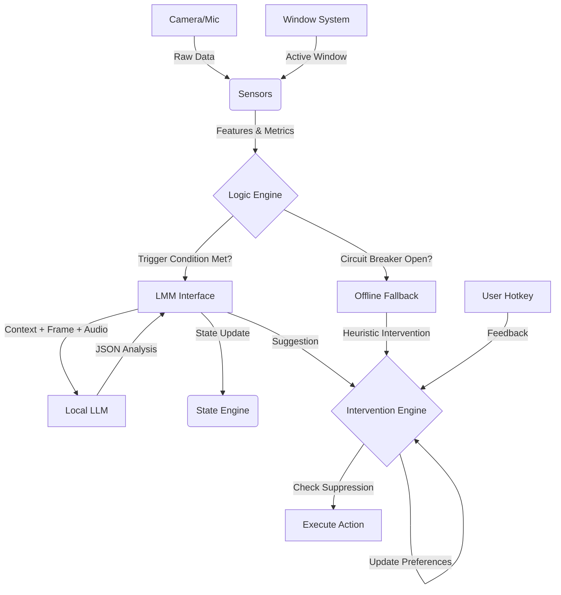

# ASDGPT Architecture & Data Flow

This document details the internal architecture of ASDGPT, explaining how sensor data flows through the system to generate state estimations and interventions.

## High-Level Overview

ASDGPT operates on a continuous feedback loop:
1.  **Sensors** capture raw audio, video, and active window data.
2.  **Logic Engine** processes this data into features, checks for triggers (including Meeting Mode), and coordinates logic.
3.  **LMM (Large Multi-modal Model)** analyzes the context to estimate user state and suggest interventions.
4.  **State Engine** smooths and tracks the 5-dimensional user state.
5.  **Intervention Engine** executes actions (TTS, sounds) if needed, including offline fallbacks.
6.  **User Feedback** (via hotkeys) reinforces or suppresses specific interventions.

---

## Core Components

### 1. Sensors (`sensors/`)
The system uses modular sensors to extract features before any AI processing occurs.

*   **AudioSensor** (`sensors/audio_sensor.py`):
    *   **Features**: `rms` (loudness), `zcr` (noisiness), `pitch_estimation`, `speech_rate` (syllables/sec).
    *   **VAD (Voice Activity Detection)**: Uses heuristics (pitch + ZCR + variance) to determine `is_speech` and `speech_confidence`.
*   **VideoSensor** (`sensors/video_sensor.py`):
    *   **Features**: `video_activity` (motion intensity), `face_detected`, `face_count`.
    *   **Metrics**: `face_roll_angle` (head tilt), `posture_state` (e.g., "slouching", "leaning_forward").
*   **WindowSensor** (`sensors/window_sensor.py`):
    *   **Function**: Detects the currently active application window title.
    *   **Privacy**: Automatically redacts sensitive information (e.g., email addresses, file paths, and configured sensitive app names like "Password Manager").
    *   **Context**: Provides critical context (e.g., "Visual Studio Code" vs. "YouTube") to the Logic Engine.

### 2. Logic Engine (`core/logic_engine.py`)
The central coordinator ("The Brain"). It runs the main event loop.

*   **Triggers**: It decides *when* to call the expensive LMM.
    *   **High Audio Event**: Loudness > threshold AND identified as speech.
    *   **High Video Activity**: Motion > threshold AND face detected.
    *   **Periodic Check**: Every ~5 seconds (configurable) if no event occurs.
*   **Meeting Mode (Auto-DND)**:
    *   **Heuristic**: Automatically switches to "Do Not Disturb" if it detects continuous speech + face presence + no keyboard/mouse input for a set duration (default 10s).
    *   **Exit**: Automatically returns to "Active" mode when user input is detected.
*   **Offline Fallback**:
    *   If the LMM circuit breaker is open (due to repeated failures), the Logic Engine triggers simple, heuristic-based interventions (e.g., "It's getting loud") directly via the Intervention Engine.
*   **Payload Construction**: Bundles sensor metrics, the latest video frame (Base64), raw audio snippet, active window title, and current state context into a JSON payload for the LMM.

### 3. LMM Integration (`core/lmm_interface.py`)
Interfaces with the local Large Language Model (e.g., deepseek via Oobabooga/LM Studio).

*   **Analysis**: Sends the payload to the LMM.
*   **Output**: Expects a JSON response containing:
    *   `state_estimation`: Updates for the 5D state.
    *   `visual_context`: Tags like "phone_usage", "messy_room".
    *   `intervention_suggestion`: A recommended intervention ID (or null).
*   **Reflexive Triggers**: The Logic Engine monitors `visual_context` tags for persistence (e.g., "phone_usage" > threshold) to trigger immediate interventions like `doom_scroll_breaker`, overriding standard suggestions.

### 4. State Engine (`core/state_engine.py`)
Maintains the "Mental Model" of the user.

*   **5 Dimensions**: `Arousal`, `Overload`, `Focus`, `Energy`, `Mood` (0-100 scale).
*   **Smoothing**: Applies a moving average to LMM outputs to prevent jitter.
*   **Baseline**: Initialized with user-specific baselines (defined in `config.py`).

### 5. Intervention Engine (`core/intervention_engine.py`)
Executes the actual "co-regulation" actions.

*   **Library**: Loads standardized interventions from `core/intervention_library.py` (e.g., "box_breathing", "posture_reset").
*   **Actions**: Supports `speak` (TTS), `play_sound` (WAV/MP3), `show_visual`, `wait`.
*   **Prioritization**:
    *   **System Triggers**: Specific logic (e.g., "Doom Scroll" detection) takes precedence.
    *   **Suppression**: Interventions marked "unhelpful" are blocked for a cooldown period.

### 6. Feedback Loop
User feedback determines future system behavior.

*   **Inputs**: Hotkeys for "Helpful" (`Ctrl+Alt+Up`) and "Unhelpful" (`Ctrl+Alt+Down`).
*   **Logic**:
    *   **Unhelpful**: Suppresses that intervention type for `FEEDBACK_SUPPRESSION_MINUTES` (default 4 hours).
    *   **Helpful**: Increments a preference counter, making that intervention more likely to be selected in tie-breakers (future).

---

## Data Flow Diagram

## Configuration & Tuning

The system behavior is highly tunable via `config.py` or `user_data/config.json`:

*   **Sensitivity**: Adjust `AUDIO_THRESHOLD_HIGH` or `VIDEO_ACTIVITY_THRESHOLD_HIGH`.
*   **VAD**: Tune `VAD_SILENCE_THRESHOLD` if background noise is triggering checks.
*   **Baselines**: Set your "normal" state in `BASELINE_STATE` so the system knows what deviation looks like.
